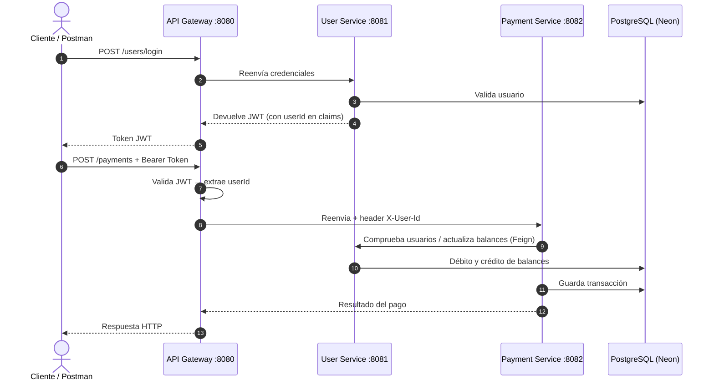

# PagosMicroservicios

API de gestión de usuarios y pagos construida con arquitectura de microservicios, Spring Boot, Spring Cloud Gateway, Spring Security, JWT, Spring Data JPA, PostgreSQL y Docker.

El objetivo del proyecto es demostrar una arquitectura backend modular y cercana a un entorno real: autenticación centralizada, propagación de identidad entre servicios, comunicación con Feign, separación de responsabilidades y despliegue con Docker Compose.

---

## Arquitectura

```text
Cliente / Postman
      │
      ▼
API Gateway ── puerto 8080  (único punto de entrada)
      │  Valida JWT → extrae userId → propaga X-User-Id header
      │
      ├── User Service ── red interna :8081
      │       └── Registro, login, gestión de usuarios y emisión de JWT
      │
      └── Payment Service ── red interna :8082
              └── Creación y consulta de pagos entre usuarios
```

> Los puertos 8081 y 8082 **no están expuestos al host**. Solo el Gateway (8080) es accesible desde fuera. Los microservicios se comunican por la red interna de Docker.

### Flujo de autenticación y pago



---

## Tecnologías

- Java 21
- Spring Boot 4
- Spring Cloud Gateway (MVC)
- Spring Security + JWT (jjwt)
- Spring Data JPA / Hibernate (`@SoftDelete`)
- OpenFeign (comunicación entre servicios)
- PostgreSQL (Neon cloud)
- Docker y Docker Compose
- JUnit 5 + Mockito + MockMvc
- Maven

---

## Requisitos

**Con Docker (recomendado):**
- Docker Desktop o Docker Engine con Docker Compose

**Sin Docker:**
- Java 21
- Maven 3.9+
- PostgreSQL accesible

---

## Inicio rápido con Docker

### 1. Clona el repositorio

```bash
git clone https://github.com/GonzaloPerezGimenez/PagosMicroservicios.git
cd PagosMicroservicios
```

### 2. Crea el archivo `.env`

```bash
cp .env.example .env
```

Abre `.env` y rellena tus credenciales de base de datos.

### 3. Arranca todo

```bash
docker compose up --build
```

La API queda disponible en `http://localhost:8080`.

Para detener:

```bash
docker compose down
```

---

## Configuración del entorno

```env
# JWT
JWT_SECRET=vcGaq5k1m0VMQrjqzNoCRtHhS/+HecujQ30kr8PfSXc=

# Base de datos – User Service
SPRING_USERDB_URL=jdbc:postgresql://<host_neon>/users_db?sslmode=require&channel_binding=require
SPRING_DATASOURCE_USERNAME=neondb_owner
SPRING_DATASOURCE_PASSWORD=tu_password

# Base de datos – Payment Service
SPRING_PAYMENTDB_URL=jdbc:postgresql://<host_neon>/db_payments?sslmode=require&channel_binding=require

# No cambiar
SPRING_DATASOURCE_DRIVER_CLASS_NAME=org.postgresql.Driver
USER_SERVICE_URL=http://localhost:8081
PAYMENT_SERVICE_URL=http://localhost:8082
```

---

## Endpoints

Todos los endpoints se consumen desde el Gateway en `http://localhost:8080`.

### Autenticación y usuarios

| Método | Endpoint | Auth | Descripción |
|--------|----------|------|-------------|
| `POST` | `/users` | No | Registra un nuevo usuario |
| `POST` | `/users/login` | No | Login — devuelve JWT |
| `GET` | `/users` | JWT | Lista todos los usuarios |
| `GET` | `/users/{id}` | JWT | Consulta usuario por ID |
| `PUT` | `/users/{id}/update` | JWT | Actualiza datos de usuario |
| `DELETE` | `/users/{id}` | JWT | Soft delete de usuario |

### Pagos

| Método | Endpoint | Auth | Descripción |
|--------|----------|------|-------------|
| `POST` | `/payments` | JWT | Crea un pago entre dos usuarios |
| `GET` | `/payments` | JWT | Lista todos los pagos |
| `GET` | `/payments/{id}` | JWT | Pagos del usuario autenticado |
| `GET` | `/payments/users` | JWT | Lista usuarios desde Payment Service |
| `GET` | `/payments/users/{id}` | JWT | Consulta usuario (solo el propio) |
| `PUT` | `/payments/users/{id}/update` | JWT | Actualiza usuario (solo el propio) |
| `POST` | `/payments/users/{id}/deposit` | JWT | Deposita saldo (solo el propio) |
| `POST` | `/payments/users/{id}/withdraw` | JWT | Retira saldo (solo el propio) |

> Los endpoints marcados con "solo el propio" verifican que el `userId` del token coincide con el `{id}` de la URL. Un usuario no puede operar sobre la cuenta de otro.

---

## Tests

El proyecto incluye tests unitarios y de controller con JUnit 5 + Mockito + MockMvc.

**User Service:**
- `UserControllerTest` — 7 tests de controller con MockMvc y `@WebMvcTest`
- `UserServiceAppTest` — tests unitarios del servicio con mocks

**Payment Service:**
- `PaymentsControllerTest` — 7 tests de controller con MockMvc y `@WebMvcTest`
- `PaymentsServicesApplicationTests` — 9 tests unitarios del servicio

Técnicas demostradas: `@Mock`, `@InjectMocks`, `@MockitoBean`, `verify()`, `assertThrows()`, `never()`, `verifyNoMoreInteractions()`, `jsonPath()`, `@DisplayName`.

---

## Prueba rápida

### 1. Crear dos usuarios

```bash
curl -X POST http://localhost:8080/users \
  -H "Content-Type: application/json" \
  -d '{"nombre": "Demo Uno", "username": "demo1", "password": "demo1234"}'

curl -X POST http://localhost:8080/users \
  -H "Content-Type: application/json" \
  -d '{"nombre": "Demo Dos", "username": "demo2", "password": "demo1234"}'
```

### 2. Login

```bash
curl -X POST http://localhost:8080/users/login \
  -H "Content-Type: application/json" \
  -d '{"username": "demo1", "password": "demo1234"}'
```

### 3. Depositar saldo

```bash
curl -X POST http://localhost:8080/payments/users/1/deposit \
  -H "Authorization: Bearer TU_TOKEN" \
  -H "Content-Type: application/json" \
  -d '{"amount": 100}'
```

### 4. Crear un pago

```bash
curl -X POST http://localhost:8080/payments \
  -H "Authorization: Bearer TU_TOKEN" \
  -H "Content-Type: application/json" \
  -d '{"amount": 25.50, "sendId": 1, "receiveId": 2}'
```

---

## Estructura del proyecto

```text
PagosMicroservicios/
├── Gateway_Service/
│   ├── src/
│   │   └── Authentication/
│   │       ├── AuthenticationFilter.java
│   │       ├── JwtUtil.java
│   │       └── MutableHttpServletRequest.java
│   ├── Dockerfile
│   └── pom.xml
├── User_Services/
│   ├── src/
│   ├── Dockerfile
│   └── pom.xml
├── Payments_Services/
│   ├── src/
│   ├── Dockerfile
│   └── pom.xml
├── docker-compose.yml
├── .env.example
├── .gitignore
└── README.md
```

---

## Buenas prácticas aplicadas

- API Gateway como único punto de entrada
- JWT con claims personalizados (`userId`) para propagar identidad
- `MutableHttpServletRequest` para inyectar headers en el pipeline de servlets
- Autorización a nivel de recurso — un usuario solo puede operar sobre sus propios datos
- Microservicios sin puertos expuestos (solo accesibles por red interna Docker)
- Comunicación entre servicios con OpenFeign + `FeignErrorDecoder` personalizado
- Manejo global de excepciones con `@RestControllerAdvice`
- DTOs para no exponer entidades ni contraseñas
- Soft delete con `@SoftDelete` de Hibernate
- Variables de entorno para toda la configuración sensible

---

## Demo

¿Quieres probarlo sin configurar base de datos ni variables de entorno?

Escríbeme y te envío las credenciales de demo en menos de 24h:

- 💼 [LinkedIn – Gonzalo Pérez Giménez](https://www.linkedin.com/in/gonzalo-perez-gimenez)
- 🐙 [GitHub – GonzaloPerezGimenez](https://github.com/GonzaloPerezGimenez)

---

## Roadmap

- [ ] Colección de Postman
- [ ] Swagger / OpenAPI por servicio
- [ ] CI con GitHub Actions

---

## Autor

Gonzalo Pérez Giménez · [GitHub](https://github.com/GonzaloPerezGimenez)
