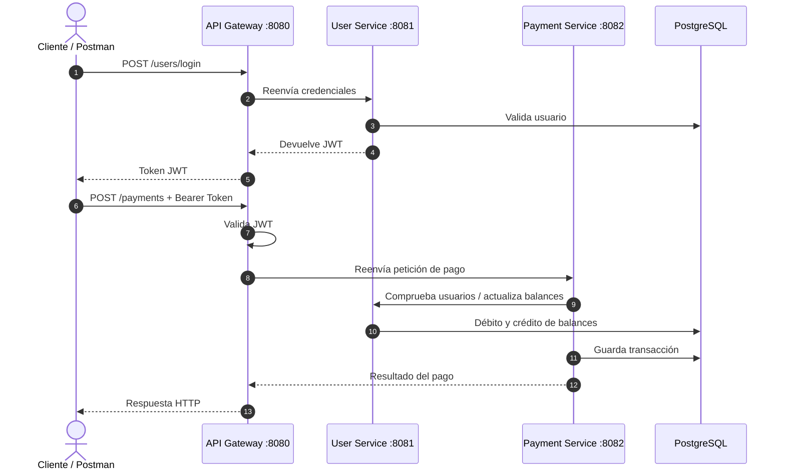

# PagosMicroservicios

API de gestión de usuarios y pagos construida con arquitectura de microservicios, Spring Boot, Spring Cloud Gateway, Spring Security, JWT, Spring Data JPA, PostgreSQL y Docker.

El objetivo del proyecto es demostrar una arquitectura backend modular y cercana a un entorno real: autenticación centralizada, comunicación entre servicios, separación de responsabilidades y despliegue con Docker Compose.

## Arquitectura

```text
Cliente / Postman
      │
      ▼
API Gateway - puerto 8080
      │
      ├── User Service - puerto 8081
      │       └── Registro, login, consulta de usuarios y emisión de JWT
      │
      └── Payment Service - puerto 8082
              └── Creación y consulta de pagos
```

### Flujo de creación de un pago



| Servicio | Responsabilidad |
| --- | --- |
| `Gateway_Service` | Punto de entrada único. Enruta peticiones hacia los microservicios y valida JWT. |
| `User_Services` | Registro, login, gestión de usuarios y generación de tokens JWT. |
| `Payments_Services` | Gestión de pagos y consulta de transacciones entre usuarios. |

## Tecnologías

- Java 21
- Spring Boot
- Spring Cloud Gateway
- Spring Security
- JWT
- Spring Data JPA / Hibernate
- PostgreSQL
- Maven multi-módulo
- Docker y Docker Compose

## Requisitos

Para ejecutarlo con Docker:

- Docker Desktop o Docker Engine
- Docker Compose
- Una base de datos PostgreSQL accesible, por ejemplo local, Neon, Railway, Supabase, etc.

Para ejecutarlo manualmente:

- Java 21
- Maven 3.9+
- PostgreSQL

## Configuración del entorno

El proyecto usa variables de entorno. Por seguridad, el archivo `.env` real no debe subirse al repositorio.

1. Copia el archivo de ejemplo:

```bash
cp .env.example .env
```

2. Edita `.env` con tus valores reales:

```env
JWT_SECRET=change-me-use-a-long-base64-secret-at-least-32-bytes
SPRING_USERDB_URL=jdbc:postgresql://localhost:5432/users_db
SPRING_PAYMENTDB_URL=jdbc:postgresql://localhost:5432/payments_db
SPRING_DATASOURCE_USERNAME=postgres
SPRING_DATASOURCE_PASSWORD=postgres
SPRING_DATASOURCE_DRIVER_CLASS_NAME=org.postgresql.Driver
USER_SERVICE_URL=http://user-service:8081
PAYMENT_SERVICE_URL=http://payment-service:8082
```

> Nota: para reclutadores, se recomienda crear credenciales de prueba o usar una base de datos temporal sin datos sensibles.

## Ejecución con Docker Compose

Desde la raíz del proyecto:

```bash
docker compose up --build
```

La API quedará disponible en:

```text
http://localhost:8080
```

Para detener los contenedores:

```bash
docker compose down
```

## Ejecución manual

Compila el proyecto desde la raíz:

```bash
mvn clean install
```

Arranca los servicios en terminales separadas:

```bash
cd User_Services
mvn spring-boot:run
```

```bash
cd Payments_Services
mvn spring-boot:run
```

```bash
cd Gateway_Service
mvn spring-boot:run
```

## Endpoints principales

Todos los endpoints se consumen desde el Gateway:

```text
http://localhost:8080
```

### Usuarios y autenticación

| Método | Endpoint | Autenticación | Body / parámetros | Descripción |
| --- | --- | --- | --- | --- |
| `POST` | `/users` | No | JSON con `nombre`, `username`, `password` | Registra un nuevo usuario. |
| `POST` | `/users/login` | No | JSON con `username`, `password` | Inicia sesión y devuelve un JWT. |
| `GET` | `/users` | Según configuración del Gateway | - | Lista los usuarios registrados. |
| `GET` | `/users/{id}` | Según configuración del Gateway | Path variable `id` | Consulta un usuario por ID. |
| `POST` | `/users/{id}/debit?amount=10.00` | Interno / protegido | Query param `amount` | Resta saldo a un usuario. |
| `POST` | `/users/{id}/credit?amount=10.00` | Interno / protegido | Query param `amount` | Suma saldo a un usuario. |
| `PUT` | `/users/{id}/update` | Según configuración del Gateway | JSON con campos a actualizar | Actualiza datos de un usuario. |
| `DELETE` | `/users/{id}` | Según configuración del Gateway | Path variable `id` | Elimina o desactiva un usuario. |

### Pagos

| Método | Endpoint | Autenticación | Body / parámetros | Descripción |
| --- | --- | --- | --- | --- |
| `POST` | `/payments` | JWT recomendado | JSON con `amount`, `sendId`, `receiveId` | Crea un pago entre dos usuarios. |
| `GET` | `/payments` | JWT recomendado | - | Lista todos los pagos. |
| `GET` | `/payments/{id}` | JWT recomendado | Path variable `id` del usuario | Lista los pagos asociados a un usuario. |
| `GET` | `/payments/users` | JWT recomendado | - | Lista usuarios desde el servicio de pagos. |
| `GET` | `/payments/users/{id}` | JWT + header `X-User-Id` | Path variable `id` | Consulta un usuario desde pagos validando el usuario autenticado. |
| `PUT` | `/payments/users/{id}/update` | JWT recomendado | JSON con campos a actualizar | Actualiza un usuario desde el servicio de pagos. |

> Nota: el endpoint de registro es `POST /users`. No uses `/users/register` salvo que añadas esa ruta explícitamente en el controlador.

## Prueba rápida con Postman o cURL

### 1. Crear dos usuarios de prueba

```bash
curl -X POST http://localhost:8080/users \
  -H "Content-Type: application/json" \
  -d '{
    "nombre": "Usuario Demo 1",
    "username": "demo1",
    "password": "demo1234"
  }'
```

```bash
curl -X POST http://localhost:8080/users \
  -H "Content-Type: application/json" \
  -d '{
    "nombre": "Usuario Demo 2",
    "username": "demo2",
    "password": "demo1234"
  }'
```

### 2. Login

```bash
curl -X POST http://localhost:8080/users/login \
  -H "Content-Type: application/json" \
  -d '{
    "username": "demo1",
    "password": "demo1234"
  }'
```

Copia el token JWT devuelto por el login. En Postman puedes guardarlo como variable `token`.

### 3. Crear un pago

```bash
curl -X POST http://localhost:8080/payments \
  -H "Content-Type: application/json" \
  -H "Authorization: Bearer TU_TOKEN_JWT" \
  -d '{
    "amount": 25.50,
    "sendId": 1,
    "receiveId": 2
  }'
```

### 4. Consultar pagos

```bash
curl -X GET http://localhost:8080/payments \
  -H "Authorization: Bearer TU_TOKEN_JWT"
```

```bash
curl -X GET http://localhost:8080/payments/1 \
  -H "Authorization: Bearer TU_TOKEN_JWT"
```

### 5. Consultar usuarios

```bash
curl -X GET http://localhost:8080/users \
  -H "Authorization: Bearer TU_TOKEN_JWT"
```

## Estructura del proyecto

```text
PagosMicroservicios/
├── Gateway_Service/
│   ├── src/
│   ├── Dockerfile
│   └── pom.xml
├── User_Services/
│   ├── src/
│   ├── Dockerfile
│   └── pom.xml
├── Payments_Services/
│   ├── src/
│   ├── Dockerfile
│   └── pom.xml
├── docker-compose.yml
├── .env.example
├── .gitignore
├── README.md
└── pom.xml
```

## Buenas prácticas aplicadas

- Separación por microservicios.
- API Gateway como entrada única.
- Configuración mediante variables de entorno.
- Eliminación de credenciales del código fuente.
- Dockerización independiente por servicio.
- Maven multi-módulo para compilar desde la raíz.

## Seguridad

No se deben subir archivos `.env`, contraseñas, tokens ni URLs privadas con credenciales al repositorio. Si alguna credencial ha sido publicada, debe rotarse inmediatamente y eliminarse del historial de Git.

## Roadmap

- Añadir colección de Postman.
- Añadir Swagger/OpenAPI por servicio.
- Añadir tests unitarios e integración.
- Añadir base de datos local opcional en `docker-compose.yml` para demo completa.
- Añadir CI con GitHub Actions.

## Autor

Gonzalo Pérez Giménez

- GitHub: [GonzaloPerezGimenez](https://github.com/GonzaloPerezGimenez)
