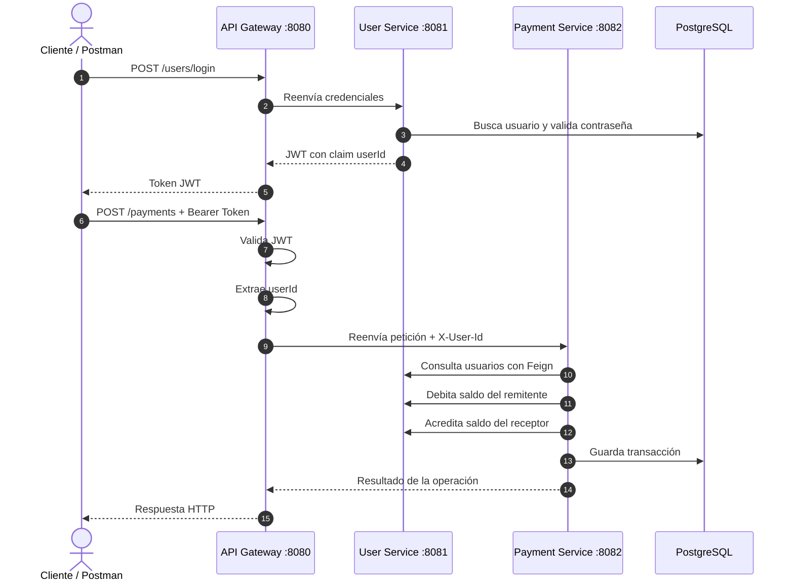

# PagosMicroservicios


API backend de usuarios y pagos desarrollada con arquitectura de microservicios. El proyecto está orientado a demostrar conocimientos prácticos de Spring Boot, seguridad con JWT, comunicación entre servicios, persistencia con PostgreSQL, despliegue con Docker y testing automatizado.

El sistema expone un único punto de entrada mediante un API Gateway. Desde ahí se enrutan las peticiones hacia los servicios internos de usuarios y pagos, manteniendo los microservicios aislados dentro de la red Docker.

---

## Índice

- [Valor técnico del proyecto](#valor-técnico-del-proyecto)
- [Arquitectura](#arquitectura)
- [Flujo principal](#flujo-principal)
- [Tecnologías](#tecnologías)
- [Funcionalidades](#funcionalidades)
- [Estructura del repositorio](#estructura-del-repositorio)
- [Configuración](#configuración)
- [Ejecución con Docker](#ejecución-con-docker)
- [Endpoints](#endpoints)
- [Ejemplo de uso](#ejemplo-de-uso)
- [Testing y CI/CD](#testing-y-cicd)
- [Decisiones de diseño](#decisiones-de-diseño)
- [Roadmap](#roadmap)
- [Autor](#autor)

---

## Valor técnico del proyecto

Este repositorio demuestra competencias relevantes para un entorno backend profesional:

- Arquitectura distribuida con **3 servicios independientes**.
- **API Gateway** como único punto de entrada externo.
- Autenticación stateless con **JWT**.
- Propagación de identidad entre servicios mediante header `X-User-Id`.
- Comunicación síncrona entre microservicios con **OpenFeign**.
- Persistencia con **Spring Data JPA**, Hibernate y PostgreSQL.
- Separación entre controlador, servicio, repositorio, DTOs, modelos y excepciones.
- Manejo centralizado de errores con `@RestControllerAdvice`.
- Validación de entrada con Jakarta Validation.
- Contraseñas cifradas con `BCryptPasswordEncoder`.
- Soft delete de usuarios con Hibernate `@SoftDelete`.
- Dockerización individual de cada servicio y orquestación con Docker Compose.
- Pipeline de GitHub Actions para build, tests y publicación de imágenes Docker.
- Suite de **40 tests automatizados** con JUnit 5, Mockito y MockMvc.

---

## Arquitectura

```text
Cliente / Postman / Frontend
        │
        ▼
┌────────────────────────────┐
│ API Gateway                │
│ Puerto público: 8080       │
│ - Valida JWT               │
│ - Extrae userId del token  │
│ - Propaga X-User-Id        │
└─────────────┬──────────────┘
              │
      ┌───────┴────────┐
      ▼                ▼
┌───────────────┐  ┌────────────────┐
│ User Service  │  │ Payment Service│
│ Puerto: 8081  │  │ Puerto: 8082   │
│ Red interna   │  │ Red interna    │
└───────┬───────┘  └───────┬────────┘
        │                  │
        ▼                  ▼
 PostgreSQL            PostgreSQL
 users_db              db_payments
```

En la configuración Docker actual, solo el Gateway expone puerto al host. `User Service` y `Payment Service` quedan accesibles únicamente dentro de la red interna `microservices-network`.

---

## Flujo principal



---

## Tecnologías

| Categoría | Tecnología |
|---|---|
| Lenguaje | Java 21 |
| Framework principal | Spring Boot 4.x |
| Gateway | Spring Cloud Gateway MVC |
| Seguridad | Spring Security, JWT, BCrypt |
| Persistencia | Spring Data JPA, Hibernate |
| Base de datos | PostgreSQL / Neon |
| Comunicación interna | OpenFeign |
| Validación | Jakarta Validation |
| Documentación API | Springdoc OpenAPI, dependencia incluida |
| Testing | JUnit 5, Mockito, MockMvc |
| Build | Maven multi-module |
| Contenedores | Docker, Docker Compose |
| CI/CD | GitHub Actions, Docker build/push |

---

## Funcionalidades

### User Service

- Registro de usuarios.
- Login y generación de token JWT.
- Consulta de usuarios.
- Consulta de usuario por ID.
- Actualización de datos del usuario.
- Eliminación lógica de usuario.
- Gestión de saldo: débito y crédito.
- Encriptación de contraseña con BCrypt.
- DTO de respuesta para no exponer contraseñas.

### Payment Service

- Creación de pagos entre usuarios.
- Consulta de pagos.
- Consulta de pagos por usuario.
- Depósito de saldo.
- Retirada de saldo.
- Validación de saldo suficiente.
- Validación para evitar pagos al mismo usuario.
- Consulta de usuarios desde el servicio de pagos usando OpenFeign.
- Decodificación personalizada de errores de Feign.

### API Gateway

- Enrutamiento hacia User Service y Payment Service.
- Validación centralizada del token JWT.
- Bloqueo de peticiones sin token en rutas protegidas.
- Propagación del usuario autenticado mediante `X-User-Id`.
- Manejo de errores de autenticación: token ausente, formato inválido, token expirado o token inválido.

---

## Estructura del repositorio

```text
PagosMicroservicios/
├── Gateway_Service/
│   ├── src/main/java/com/gateway/Gateway_Service/
│   │   ├── Authentication/
│   │   │   ├── AuthenticationFilter.java
│   │   │   ├── JwtUtil.java
│   │   │   └── MutableHttpServletRequest.java
│   │   └── SecurityConfig/
│   ├── Dockerfile
│   └── pom.xml
│
├── User_Services/
│   ├── src/main/java/com/Proyect/UserService/
│   │   ├── config/
│   │   ├── controller/
│   │   ├── exceptions/
│   │   ├── model/
│   │   ├── repository/
│   │   └── service/
│   ├── src/test/java/
│   ├── Dockerfile
│   └── pom.xml
│
├── Payments_Services/
│   ├── src/main/java/com/Paymentshub/Payments_Services/
│   │   ├── client/
│   │   ├── config/
│   │   ├── controller/
│   │   ├── exceptions/
│   │   ├── models/
│   │   ├── repository/
│   │   └── service/
│   ├── src/test/java/
│   ├── Dockerfile
│   └── pom.xml
│
├── .github/workflows/ci-cd.yml
├── .env.example
├── docker-compose.yml
├── pom.xml
└── README.md
```

---

## Configuración

El proyecto utiliza variables de entorno para separar configuración sensible del código fuente.

Copia el archivo de ejemplo:

```bash
cp .env.example .env
```

Ejemplo de configuración:

```env
# JWT
JWT_SECRET=BASE64_SECRET_KEY

# User Service database
SPRING_USERDB_URL=jdbc:postgresql://HOST/users_db?sslmode=require
SPRING_DATASOURCE_USERNAME=YOUR_DB_USER
SPRING_DATASOURCE_PASSWORD=YOUR_DB_PASSWORD

# Payment Service database
SPRING_PAYMENTDB_URL=jdbc:postgresql://HOST/db_payments?sslmode=require

# PostgreSQL driver
SPRING_DATASOURCE_DRIVER_CLASS_NAME=org.postgresql.Driver

# Internal Docker URLs
USER_SERVICE_URL=http://user-service:8081
PAYMENT_SERVICE_URL=http://payment-service:8082
```

> Importante: el archivo `.env` no debe subirse al repositorio. Ya está incluido en `.gitignore`.

---

## Ejecución con Docker

### 1. Clonar el repositorio

```bash
git clone https://github.com/GonzaloPerezGimenez/PagosMicroservicios.git
cd PagosMicroservicios
```

### 2. Crear el archivo `.env`

```bash
cp .env.example .env
```

Edita `.env` con tus credenciales reales de PostgreSQL/Neon.

### 3. Levantar los servicios

```bash
docker compose up --build
```

La API quedará disponible en:

```text
http://localhost:8080
```

### 4. Detener los servicios

```bash
docker compose down
```

---

## Endpoints

Todos los endpoints se consumen a través del Gateway:

```text
http://localhost:8080
```

### Autenticación y usuarios

| Método | Endpoint | Auth | Descripción |
|---|---|---:|---|
| `POST` | `/users` | No | Registra un usuario |
| `POST` | `/users/login` | No | Autentica usuario y devuelve JWT |
| `GET` | `/users` | Sí | Lista usuarios |
| `GET` | `/users/{id}` | Sí | Obtiene usuario por ID |
| `PUT` | `/users/{id}/update` | Sí | Actualiza `nombre`, `username` o `password` |
| `DELETE` | `/users/{id}` | Sí | Elimina usuario mediante soft delete |

### Endpoints internos de saldo en User Service

Estos endpoints son utilizados principalmente por `Payment Service` para actualizar balances:

| Método | Endpoint | Parámetro | Descripción |
|---|---|---|---|
| `POST` | `/users/{id}/debit` | `amount` query param | Resta saldo al usuario |
| `POST` | `/users/{id}/credit` | `amount` query param | Suma saldo al usuario |

### Pagos

| Método | Endpoint | Auth | Descripción |
|---|---|---:|---|
| `POST` | `/payments` | Sí | Crea un pago entre dos usuarios |
| `GET` | `/payments` | Sí | Lista pagos registrados |
| `GET` | `/payments/{id}` | Sí | Lista pagos del usuario autenticado |
| `GET` | `/payments/users` | Sí | Lista usuarios desde Payment Service |
| `GET` | `/payments/users/{id}` | Sí | Consulta el usuario autenticado por ID |
| `PUT` | `/payments/users/{id}/update` | Sí | Actualiza datos del usuario autenticado |
| `POST` | `/payments/users/{id}/deposit` | Sí | Deposita saldo en el usuario autenticado |
| `POST` | `/payments/users/{id}/withdraw` | Sí | Retira saldo del usuario autenticado |

En los endpoints de pagos que incluyen `{id}`, el servicio compara el ID de la URL con el `X-User-Id` generado por el Gateway a partir del token JWT.

---

## Ejemplo de uso

### 1. Crear usuarios

```bash
curl -X POST http://localhost:8080/users \
  -H "Content-Type: application/json" \
  -d '{"nombre":"Usuario Uno","username":"user1","password":"1234"}'

curl -X POST http://localhost:8080/users \
  -H "Content-Type: application/json" \
  -d '{"nombre":"Usuario Dos","username":"user2","password":"1234"}'
```

### 2. Login

```bash
curl -X POST http://localhost:8080/users/login \
  -H "Content-Type: application/json" \
  -d '{"username":"user1","password":"1234"}'
```

La respuesta es un token JWT. Úsalo en las siguientes peticiones:

```bash
TOKEN="TU_TOKEN_JWT"
```

### 3. Depositar saldo

```bash
curl -X POST http://localhost:8080/payments/users/1/deposit \
  -H "Authorization: Bearer $TOKEN" \
  -H "Content-Type: application/json" \
  -d '{"amount":100}'
```

### 4. Realizar un pago

```bash
curl -X POST http://localhost:8080/payments \
  -H "Authorization: Bearer $TOKEN" \
  -H "Content-Type: application/json" \
  -d '{"amount":25.50,"sendId":1,"receiveId":2}'
```

### 5. Consultar pagos del usuario autenticado

```bash
curl -X GET http://localhost:8080/payments/1 \
  -H "Authorization: Bearer $TOKEN"
```

---

## Testing y CI/CD

El proyecto incluye **40 tests automatizados** de servicios y controladores.

### Cobertura funcional de tests

- Registro de usuarios.
- Encriptación de contraseña.
- Login correcto e incorrecto.
- Usuario inexistente.
- Username duplicado.
- Actualización y eliminación de usuarios.
- Validaciones de entrada en controller.
- Creación de pagos.
- Pagos al mismo usuario.
- Saldo insuficiente.
- Usuario destinatario inexistente.
- Consulta de pagos por usuario.
- Depósitos y retiradas.

### Herramientas usadas

- `JUnit 5`
- `Mockito`
- `MockMvc`
- `@WebMvcTest`
- `@Mock`
- `@InjectMocks`
- `@MockitoBean`
- `assertThrows()`
- `verify()`
- `never()`
- `jsonPath()`
- `@DisplayName`

### Ejecutar tests localmente

Con Maven instalado:

```bash
mvn clean test
```

O por servicio:

```bash
cd User_Services
mvn test

cd ../Payments_Services
mvn test

cd ../Gateway_Service
mvn test
```

### CI/CD

El repositorio incluye un workflow en `.github/workflows/ci-cd.yml` que:

1. Descarga el código.
2. Configura Java 21 con Temurin.
3. Compila el proyecto.
4. Ejecuta los tests.
5. Construye las imágenes Docker de cada microservicio.
6. Publica las imágenes en Docker Hub usando secrets del repositorio.

---

## Decisiones de diseño

### Gateway como único punto de entrada

El Gateway centraliza la validación del token y evita exponer directamente los servicios internos al exterior cuando se ejecuta con Docker Compose.

### JWT con claim `userId`

El token generado por `User Service` incluye el identificador del usuario. El Gateway lo extrae y lo propaga como header interno `X-User-Id`, permitiendo al `Payment Service` validar operaciones asociadas al usuario autenticado.

### Separación de responsabilidades

Cada microservicio tiene una responsabilidad clara:

- `User Service`: usuarios, autenticación y saldo.
- `Payment Service`: operaciones de pago y coordinación con usuarios.
- `Gateway Service`: entrada única, seguridad perimetral y enrutamiento.

### DTOs y seguridad de datos

Las respuestas de usuarios utilizan DTOs para evitar exponer la contraseña cifrada u otros detalles internos de la entidad.

### Manejo centralizado de excepciones

Los servicios implementan handlers globales para devolver respuestas HTTP consistentes ante errores de validación, entidades inexistentes, errores de negocio o fallos de comunicación entre servicios.

---

## Roadmap

Mejoras recomendadas para evolucionar el proyecto:

- [x] Dockerización de microservicios.
- [x] Docker Compose con red interna.
- [x] Autenticación con JWT.
- [x] Comunicación entre servicios con OpenFeign.
- [x] Tests unitarios y de controller.
- [x] Pipeline CI/CD con GitHub Actions.
- [ ] Añadir colección de Postman o Bruno.
- [ ] Documentar OpenAPI/Swagger con ejemplos por endpoint.
- [ ] Añadir Testcontainers para tests de integración con PostgreSQL real.
- [ ] Añadir base de datos PostgreSQL local en Docker Compose para entorno de desarrollo.
- [ ] Reforzar `POST /payments` para que el `sendId` se derive siempre del token y no del body.
- [ ] Añadir control transaccional distribuido o patrón Saga/Outbox para pagos entre servicios.
- [ ] Añadir observabilidad: logs estructurados, métricas y health checks.
- [ ] Homogeneizar nombres de paquetes y módulos.

---

## Autor

**Gonzalo Pérez Giménez**

- GitHub: [GonzaloPerezGimenez](https://github.com/GonzaloPerezGimenez)
- LinkedIn: [gonzalo-perez-gimenez](https://www.linkedin.com/in/gonzalo-perez-gimenez)
